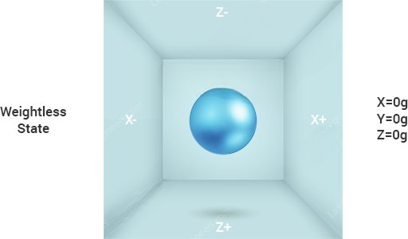
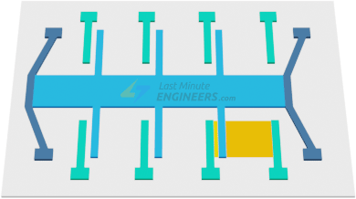
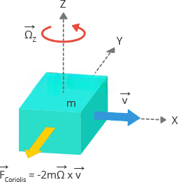
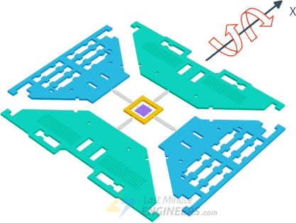
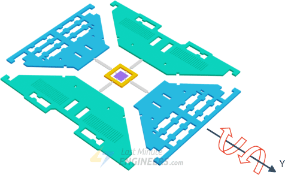
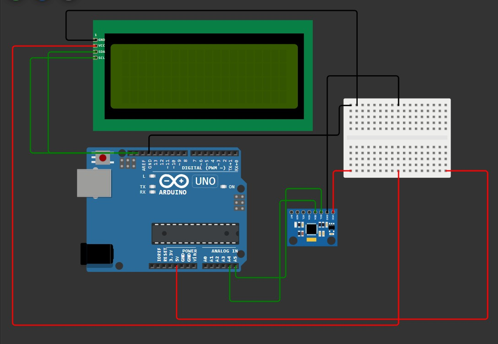

**Interface MPU6050 (Accéléromètre et Gyroscope) avec Arduino**

---

## Table des matières

1. [Introduction](#introduction)
2. [Principes de base des capteurs](#principes-de-base-des-capteurs)

   1. [Accéléromètre](#accelerometre)
   2. [Gyroscope](#gyroscope)
3. [Présentation du module MPU6050](#presentation-du-module-mpu6050)

   1. [Plages de mesure](#plages-de-mesure)
   2. [Mesure de température](#mesure-temperature)
   3. [Bus I²C externe et 9 DOF](#bus-externe)
4. [Schéma de câblage Arduino ↔ MPU6050](#schema-de-cablage)
5. [Installation des bibliothèques](#installation-des-libraries)
6. [Exemple de code Arduino](#exemple-de-code-arduino)

   1. [Calibration du capteur](#calibration)
   2. [Filtre Complémentaire (fusion accéléro/gyro)](#filtre-complementaire)
7. [Usage du DMP et quaternions](#usage-dmp)
8. [Simulation Wokwi](#simulation-wokwi)
9. [Conclusion et perspectives](#conclusion)

---

## Introduction {#introduction}

La combinaison d'un accéléromètre et d'un gyroscope dans un seul composant permet de mesurer précisément l'orientation et le mouvement d'un objet. Le MPU6050, capteur 6-axes MEMS, intègre ces deux capteurs et un DMP (Digital Motion Processor) pour simplifier l'acquisition de données via I²C.

> **À retenir :**
>
> * Le MPU6050 mesure l'accélération (X, Y, Z) et la rotation (X, Y, Z).
> * Interface I²C, deux adresses possibles (0x68 / 0x69).

---

## Principes de base des capteurs {#principes-de-base-des-capteurs}

### Accéléromètre {#accelerometre}

Un accéléromètre mesure l'accélération linéaire. Voici le modèle conceptuel :


*Alt-text : schéma simplifié d’une bille en apesanteur dans un cube.*

* En accélérant le cube de 1 g sur l’axe X, la bille appuie sur la paroi X.
* Au repos sur Terre, la bille exerce 1 g sur la paroi Z, car la gravité agit en permanence.

> **À retenir :**
>
> * La lecture d’un accéléromètre inclut l’accélération due à la gravité.
> * Les capteurs MEMS utilisent la variation de capacité entre plaques pour mesurer la déflexion.

#### MEMS : fonctionnement interne {#mems-accelerometre}


*Alt-text : animation montrant la structure suspendue par ressorts et la variation de capacité.*

Le capteur MEMS comporte un micro-masse montée sur des ressorts polysiliciés. Lors d’une accélération, la micro-masse se déplace, modifiant la distance entre plaques fixes et mobiles. Cette variation de capacité est proportionnelle à l’accélération.

---

### Gyroscope {#gyroscope}

Un gyroscope mesure la rotation angulaire via l’effet Coriolis :


*Alt-text : schéma illustrant la force de Coriolis sur une masse en mouvement oscillatoire.*

* Deux masses vibrantes génèrent un déplacement perpendiculaire proportionnel à la vitesse angulaire.

> **À retenir :**
>
> * Les capteurs MEMS détectent la rotation par changement de capacité causé par l’effet Coriolis.

#### MEMS : fonctionnement interne du gyroscope {#mems-gyroscope}


*Alt-text : animation montrant le proof mass oscillant et la détection de déflexion.*

Le MEMS gyroscope contient quatre micro-masses en oscillation horizontale. Sous rotation, la force de Coriolis dévie ces masses verticalement (Roll, Pitch) ou latéralement (Yaw). Cette déflexion modifie la capacité, permettant de calculer la vitesse angulaire.

* **Roll Mode** (axe X) : masses M1/M3 se déplacent verticalement. 
* **Pitch Mode** (axe Y) : masses M2/M4 se déplacent verticalement. 
* **Yaw Mode** (axe Z) : masses M2/M4 se déplacent latéralement. 

---

## Présentation du module MPU6050 {#presentation-du-module-mpu6050}


*Alt-text : vue du module MPU6050 avec régulateur et LED de puissance.*

* Intègre un accéléromètre 3 axes, un gyroscope 3 axes et un DMP (Digital Motion Processor).
* Alimentation : 3.3 V (régulateur embarqué), compatible 5 V sur I²C.
* Consommation : < 3.6 mA en mesure, 5 µA en veille.

> **À retenir :**
>
> * 6 DOF (accéléro + gyro), extensible à 9 DOF avec magnétomètre externe.

### Plages de mesure {#plages-de-mesure}

* **Accéléromètre** : ±2 g, ±4 g, ±8 g, ±16 g
* **Gyroscope** : ±250, ±500, ±1000, ±2000 °/s

### Mesure de température {#mesure-temperature}

Le capteur embarque un thermomètre (–40 à +85 °C, ±1 °C). Il mesure la température de la puce pour compenser la dérive des capteurs, **pas** la température ambiante.

### Bus I²C externe et 9 DOF {#bus-externe}

Deux broches (XDA, XCL) forment un bus I²C secondaire pour connecter un magnétomètre (ex : HMC5883L). Ainsi, on passe de 6 DOF à 9 DOF en mesurant champ magnétique (X, Y, Z).

---

## Schéma de câblage Arduino ↔ MPU6050 {#schema-de-cablage}

| Module MPU6050 | Arduino UNO (R3)                       |
| -------------: | :------------------------------------- |
|            VCC | 5 V                                    |
|            GND | GND                                    |
|            SDA | A4 (SDA)                               |
|            SCL | A5 (SCL)                               |
|            AD0 | non connecté (0x68) ou 3.3 V pour 0x69 |


*Alt-text : schéma de câblage Arduino vers MPU6050 sur Wokwi.*

---

## Installation des bibliothèques {#installation-des-libraries}

Installez via l’Arduino Library Manager :

```text
Adafruit MPU6050 by Adafruit (>= 1.1.0)
Adafruit Unified Sensor by Adafruit (>= 1.1.2)
LiquidCrystal I2C by Frank de Brabander (>= 1.1.4)
```

> **À retenir :**
>
> * Utilisez des versions compatibles avec votre IDE.

---

## Exemple de code Arduino {#exemple-de-code-arduino}

```cpp
#include <Wire.h>
#include <Adafruit_MPU6050.h>
#include <Adafruit_Sensor.h>
#include <LiquidCrystal_I2C.h>

LiquidCrystal_I2C lcd(0x27, 20, 4);
Adafruit_MPU6050 mpu;

const float SEUIL = 1.5;    // m/s²
String lastDir = "";
float lastX=0, lastY=0, lastZ=0;

void setup() {
  Serial.begin(9600);
  Wire.begin();
  lcd.init(); lcd.backlight(); lcd.clear();
  if (!mpu.begin()) {
    lcd.print("Capteur KO !");
    while (1) delay(500);
  }
  lcd.setCursor((20-7)/2,1);
  lcd.print("BONJOUR"); delay(1000);
  calibrateMPU();  // Calibration au démarrage
}

void loop() {
  sensors_event_t accel, gyro, temp;
  mpu.getEvent(&accel, &gyro, &temp);
  String dir = detectDirection(accel);
  if (dir != lastDir) {
    lcd.setCursor(0,0); lcd.print("                ");
    lcd.setCursor(0,0); lcd.print(dir);
    lastDir = dir;
  }
  displayValues(accel);
  delay(100);
}
```

### Calibration du capteur {#calibration}

```cpp
void calibrateMPU() {
  const int N = 200;
  float sumX=0, sumY=0, sumZ=0;
  for(int i=0; i<N; i++) {
    sensors_event_t a,g,t;
    mpu.getEvent(&a,&g,&t);
    sumX += a.acceleration.x;
    sumY += a.acceleration.y;
    sumZ += a.acceleration.z - 9.806;
    delay(5);
  }
  float offX=sumX/N, offY=sumY/N, offZ=sumZ/N;
  Serial.printf("Offsets: X=%.2f Y=%.2f Z=%.2f\n", offX, offY, offZ);
}
```

> **À retenir :** La calibration réduit les biais.

### Filtre Complémentaire (fusion accéléro/gyro) {#filtre-complementaire}

```cpp
float angleRoll=0;
const float alpha=0.98;
String detectDirection(const sensors_event_t &a) {
  float rollAcc=atan2(a.acceleration.y,a.acceleration.z)*RAD_TO_DEG;
  float gyroRate=mpu.getGyroX()/131.0;
  angleRoll=alpha*(angleRoll+gyroRate*0.01f)+(1-alpha)*rollAcc;
  return String(angleRoll,1)+"°";
}
```

> **À retenir :** Combine rapidité du gyro et stabilité de l’accéléro.

---

## Usage du DMP et quaternions {#usage-dmp}

Le DMP interne du MPU6050 calcule directement quaternions et vecteurs d’orientation, déchargeant l’Arduino :

```cpp
#include <MPU6050_6Axis_MotionApps20.h>
MPU6050 mpu;  // Note : change d’API
Quaternion q;

void setup() {
  mpu.initialize();
  mpu.dmpInitialize();
  mpu.setDMPEnabled(true);
}

void loop() {
  if (mpu.dmpGetCurrentFIFOPacket(fifoBuffer)) {
    mpu.dmpGetQuaternion(&q, fifoBuffer);
    Serial.printf("Quaternion: w=%.3f x=%.3f y=%.3f z=%.3f\n", q.w,q.x,q.y,q.z);
  }
}
```

> **À retenir :** Les quaternions évitent les problèmes de gimbal lock.

---

## Simulation Wokwi {#simulation-wokwi}

Testez en ligne sans matériel :
[Ouvrir le projet Wokwi](https://wokwi.com/projects/433364352341527553)

---

## Conclusion et perspectives {#conclusion}

Ce guide couvre :

* Principes MEMS (accéléro, gyro)
* Spécifications du MPU6050 (plages, température, bus externe)
* Câblage et code Arduino
* Calibration, fusion de capteurs et usage du DMP

**À approfondir :**

* Extraction de quaternions pour la réalité virtuelle
* Compensation de la température en temps réel
* Intégration d’un magnétomètre pour 9 DOF

---

---

## Ressources utiles {#ressources}

Voici quelques liens et tutoriels complémentaires pour approfondir :

* **MPU6050 & Arduino** : [https://randomnerdtutorials.com/arduino-mpu-6050-accelerometer-gyroscope/](https://randomnerdtutorials.com/arduino-mpu-6050-accelerometer-gyroscope/)
* **Tutoriel OLED & Arduino** : [https://randomnerdtutorials.com/arduino-oled-display-ssd1306/](https://randomnerdtutorials.com/arduino-oled-display-ssd1306/)
* **Introduction aux capteurs MEMS** : [https://www.electronics-tutorials.ws/io/io\_7.html](https://www.electronics-tutorials.ws/io/io_7.html)
* **Documentation Arduino** : [https://docs.arduino.cc/](https://docs.arduino.cc/)
* **Bibliothèques Open Source** : [https://github.com/Seeed-Studio/Seeed\_Arduino\_mpu6050](https://github.com/Seeed-Studio/Seeed_Arduino_mpu6050)
* **Principes du DMP et quaternions** : [https://www.invensense.com/wp-content/uploads/2015/02/AN-BNO080-01.pdf](https://www.invensense.com/wp-content/uploads/2015/02/AN-BNO080-01.pdf)
* **Projets DIY et Instructables** : [https://www.instructables.com/tag/type-id/category-technology/](https://www.instructables.com/tag/type-id/category-technology/)
* **Guides de programmation embarquée** : [https://www.geeksforgeeks.org/embedded-systems/](https://www.geeksforgeeks.org/embedded-systems/)

*Document rédigé par Mity.*\*
