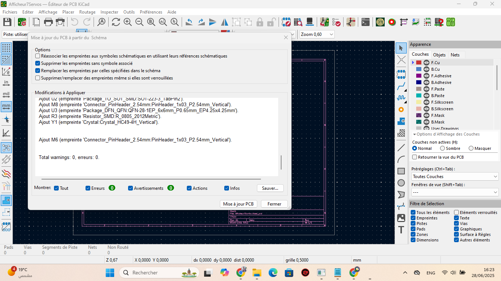
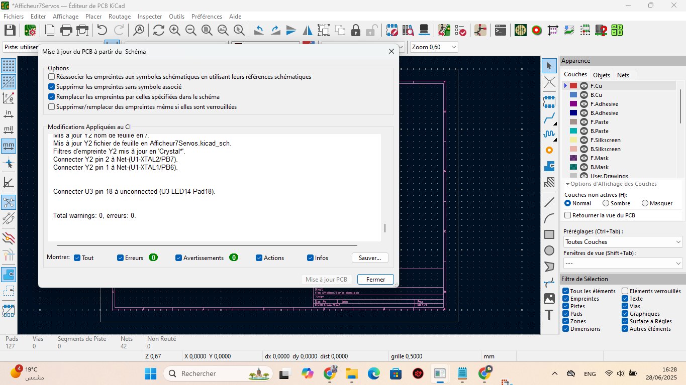
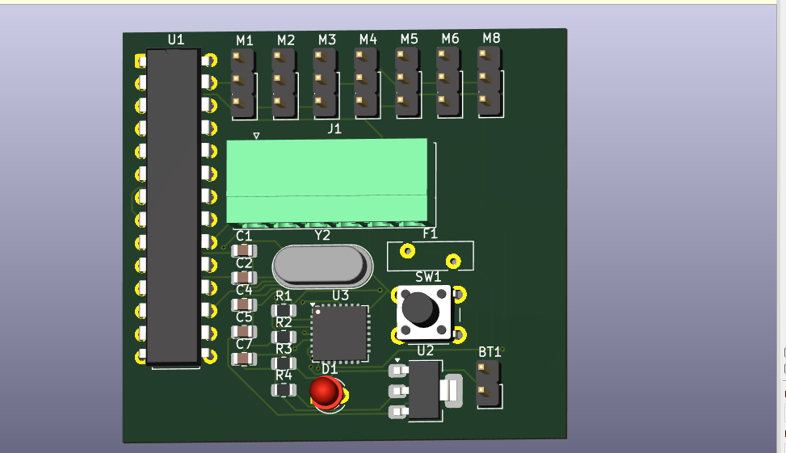
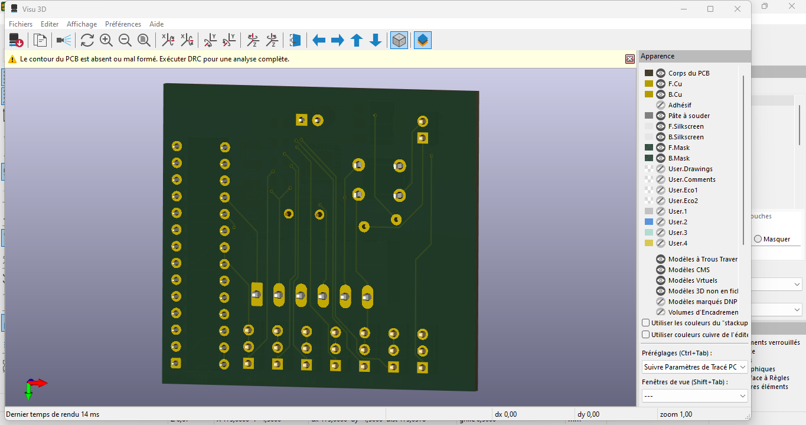

# Projet : Afficheur 7 Segments Mécanique à Servomoteurs

---

## Table des matières

1. [Introduction](#introduction)  
2. [Objectifs](#objectifs)  
3. [Matériel et empreintes KiCad](#matériel-et-empreintes-kicad)  
4. [Conception du schéma et vérifications](#conception-du-schéma-et-vérifications)  
5. [Routage et tests PCB](#routage-et-tests-pcb)  
6. [Visualisation 3D](#visualisation-3d)  
7. [Firmware Arduino (code complet)](#firmware-arduino-code-complet)  
8. [Assemblage mécanique](#assemblage-mécanique)  
9. [Tests finaux et vidéo de démonstration](#tests-finaux-et-vidéo-de-démonstration)  
10. [Structure du dépôt GitHub](#structure-du-dépôt-github)  
11. [Conclusion](#conclusion)  
12. [Annexes et photos](#annexes-et-photos)  

---

## Introduction

Dans un esprit d’innovation, ce projet propose un **afficheur 7 segments** où chaque segment est actionné mécaniquement par un servomoteur SG90. Fini les LED : c’est la rotation des bras qui dévoile ou masque chaque segment. Le cœur du pilotage est un **ATmega328P** nu, commandé en I²C via un **PCA9685**.  

---

## Objectifs

- **Électronique :** Réaliser un schéma robuste et validé sous KiCad.  
- **Mécanique :** Créer un système propre sans breadboard (PCB ou veroboard).  
- **Firmware :** Programmer sans `delay()`, pour une animation fluide 0→9→0.  
- **Documentation :** Captures, photos, code et structure de dépôt pour la reproduction.

---

## Matériel et empreintes KiCad

| Ref.   | Composant                   | Empreinte KiCad                                          |
|--------|-----------------------------|----------------------------------------------------------|
| **U1** | ATmega328P‑P                | `Package_DIP:DIP-28_W7.62mm`                             |
| **U2** | AMS1117‑5.0 (5 V LDO)       | `Regulator_SMD:AMS1117-5.0`                              |
| **U3** | PCA9685BS                   | `PCA9685:PCA9685-SOIC24`                                 |
| **Y1** | Quartz 16 MHz               | `Crystal:Crystal_HC49-4H_Vertical`                       |
| **C1–C13** | Condensateurs (22 pF…10 µF) | `Capacitor_SMD:C_0805_2012Metric` + radial pour C5   |
| **R1–R4** | Résistances (10 kΩ…330 Ω)  | `Resistor_SMD:R_0805_2012Metric`                         |
| **J1** | ISP 6 broches               | `Connector_Phoenix_MC:PhoenixContact_MC_1,5_6-G-3.5_1x06`|
| **J2–J8** | Servo header 3 p.         | `Connector_PinHeader_2.54mm:PinHeader_1x03_P2.54mm`      |
| **J9** | Batterie header 2 p.        | `Connector_PinHeader_2.54mm:PinHeader_1x02_P2.54mm`      |
| **F1** | Polyfuse 2 A                | `Fuse_PTC:PTC_1812L6036R`                                |
| **D1** | LED témoin 3 mm             | `LED_THT:LED_D3.0mm`                                     |
| **SW1**| Bouton Reset 6 mm           | `Switch_THT:SW_PUSH_6mm`                                 |

> **Astuce :** utilisez un dossier `photos/` sans espaces pour héberger toutes les images, puis référez-les en chemin relatif.  

---

## Conception du schéma et vérifications

1. **Disposition**  
   - Alimentation à gauche, MCU et driver au centre, servos à droite, indicateurs en bas.  
2. **ERC**  
   - Vérifier l’absence de conflits, résistances non connectées, etc.  
3. **Capture ERC**  
     
   *La vérification des règles électriques confirme la cohérence de tous les nets.*

---

## Routage et tests PCB

- **Placement**  
  - Composants d’alim (J9, F1, U2) groupés  
  - U1/U3 côte à côte pour minimiser les liaisons I²C  
  - Servos alignés à droite  
- **Pistes**  
  - VCC : largeur ≥ 1,5 mm (jusqu’à 3 A)  
  - GND : plan de masse continu  
  - Signaux (PWM, I²C) : largeur 0,5 mm  

  
*Montage en cours de soudure, vérification de l’alignement.*  

  
*Le PCB fonctionne parfaitement, tous les nets sont corrects.*  

---

## Visualisation 3D

Avant fabrication, exploitation du rendu KiCad pour vérifier l’encombrement et l’implantation :

  
*Vérification des hauteurs et collisions.*  

  
*Gestion des plans de masse et du passage des vis.*  

  
*Assure la compatibilité avec le boîtier ou support final.*  

---

## Firmware Arduino (code complet)

```cpp
#include <Wire.h>
#include <Adafruit_PWMServoDriver.h>

// Initialise le driver PCA9685 à l'adresse I2C 0x40
Adafruit_PWMServoDriver pwm = Adafruit_PWMServoDriver();

// Plages de commande des servos (150–600 correspond à 0°–180°)
const uint16_t servoMin = 150, servoMax = 600;

// Mapping des chiffres 0–9 sur les segments A→G (bits 0→6)
const uint8_t map7seg[10] = {
  0b0111111, 0b0000110, 0b1011011, 0b1001111,
  0b1100110, 0b1101101, 0b1111101, 0b0000111,
  0b1111111, 0b1101111
};

uint8_t digit = 0, dir = 1;
unsigned long lastTime = 0, interval = 1000; // 1 s

void setup() {
  Wire.begin();
  pwm.begin();
  pwm.setOscillatorFrequency(27000000);
  pwm.setPWMFreq(50); // 50 Hz pour servos
}

void afficher(uint8_t d) {
  for (uint8_t i = 0; i < 7; i++) {
    bool on = (map7seg[d] >> i) & 0x1;
    pwm.setPWM(i, 0, on ? servoMax : servoMin);
  }
}

void loop() {
  unsigned long now = millis();
  if (now - lastTime >= interval) {
    lastTime = now;
    afficher(digit);
    digit += dir;
    if (digit == 9 || digit == 0) dir = -dir;
  }
}
Commentaire :
 La fonction afficher() positionne chaque servo en fonction du bitmask du chiffre. On utilise millis() pour ne jamais bloquer l’exécution.

Assemblage mécanique
Segments : imprimez ou découpez 7 rectangles (3 × 15 × 3 mm).

Finition : peignez l’arrière en noir pour masquer le segment quand il est basculé.

Support servos : fixez chaque SG90 sur un support solide (alu, plexi).

Cales : ajoutez des butées à 0° et 90° (cales PLA).

Tests finaux et vidéo de démonstration
Séquence 0→9→0 : vérifier l’ordre et le timing (1 s/incrément).

Mesure de courant : surveillez la conso (jusqu’à ~1 A par servo).

Enregistrement vidéo : 20 s de démonstration pour la soutenance.

Structure du dépôt GitHub
afficheur7servos/
├─ photos/
│  ├─ test_erc_schemas.png
│  ├─ test_pcb.png
│  ├─ test_pcb_reussi.png
│  ├─ visualisation_3d_face.png
│  ├─ visualisation_3d_dos.png
│  └─ visualisation_3d_left.png
├─ schematic/
├─ pcb/
├─ 3D/
├─ firmware/
│  └─ afficheur7seg.ino
├─ datasheets/
└─ README.md
Conclusion
Ce projet démontre l’intégration harmonieuse de la mécanique, l’électronique et le code non bloquant. La documentation complète—schéma, PCB, rendus 3D, code et photos—permet une reproduction aisée et une présentation professionnelle.

Annexes et photos
Toutes les images sont disponibles dans le dossier photos/. Référez-vous aux légendes pour comprendre chaque étape du processus.

