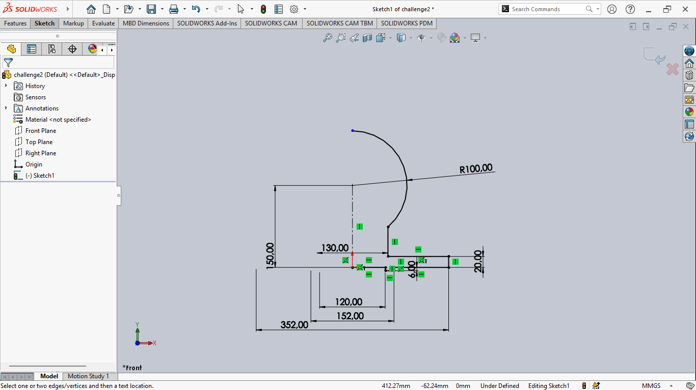
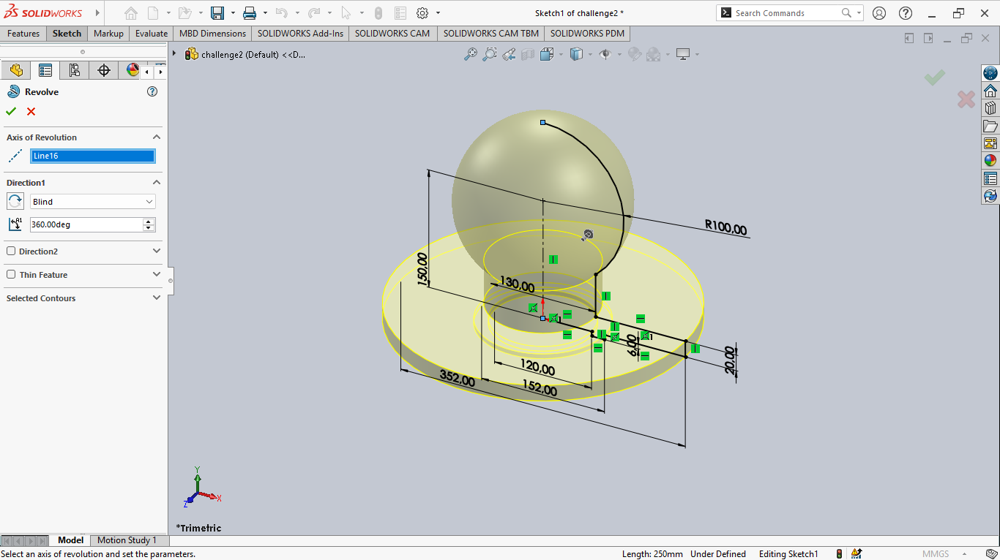
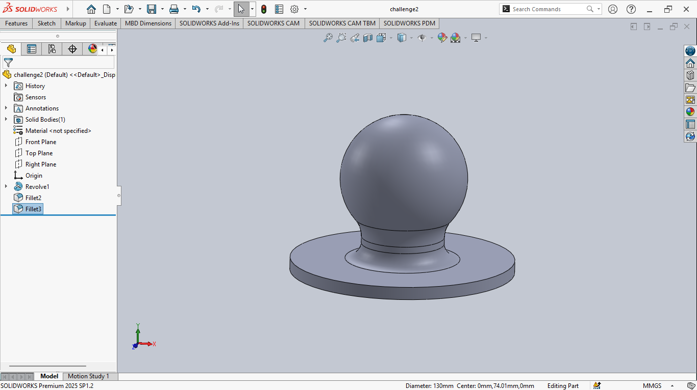
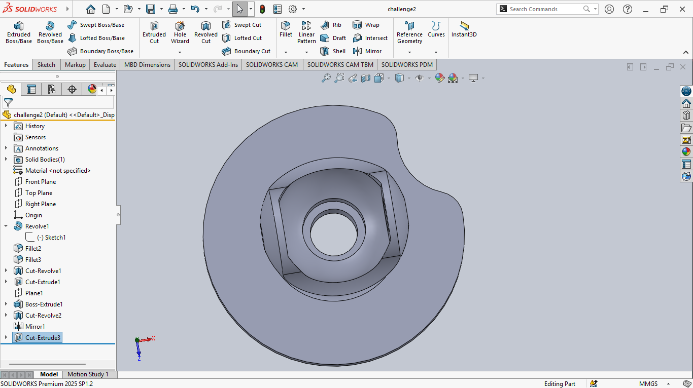
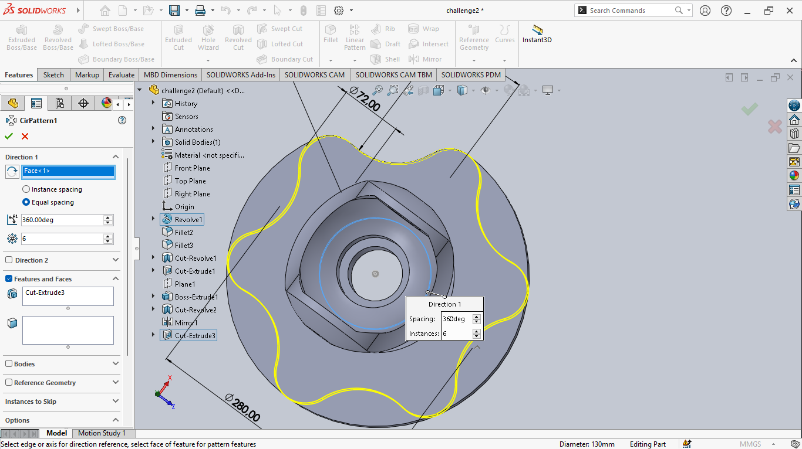
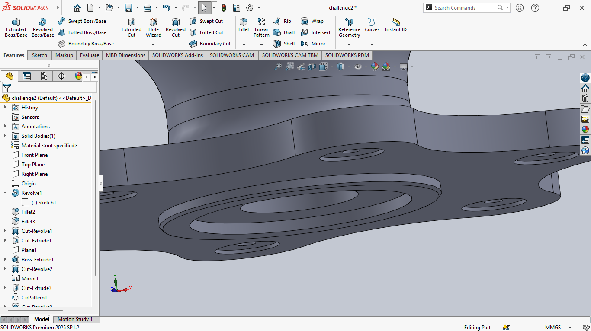
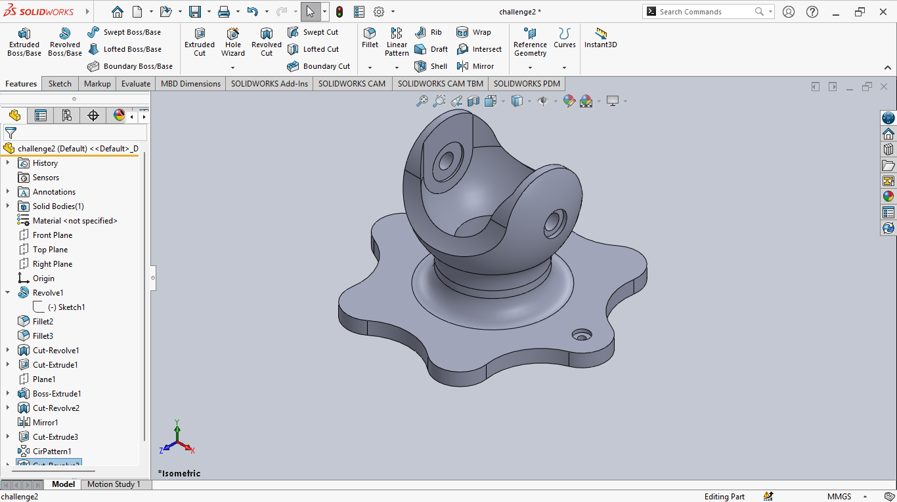
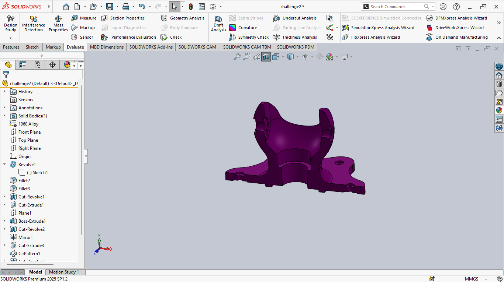
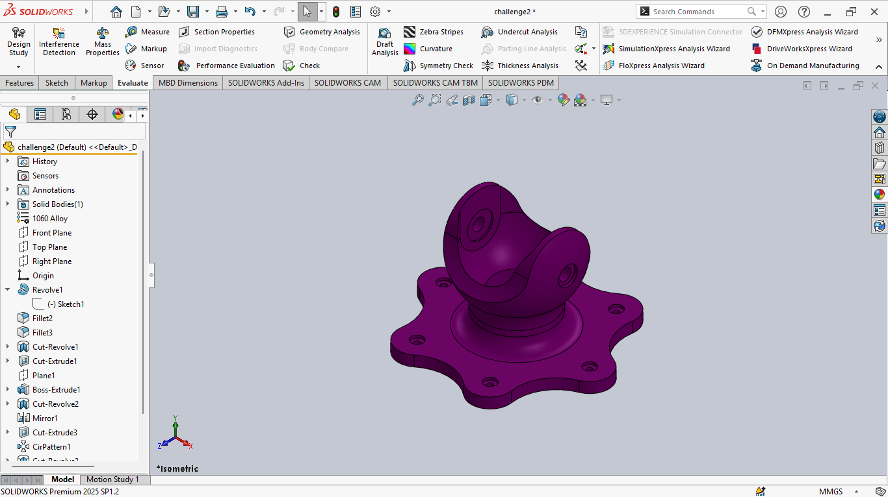

# 🚀 Challenge II – Mechanical Part Design (SolidWorks)

## 🗂️ General Information

- **Team Name**: Innovator  
- **Participants**: Muriella, Nekena, Vanilah  
- **Challenge**: TRC HEROES – Mechanical part modeling in SolidWorks  
- **Date**: June 24, 2025  
- **Constraints**:
  - All holes are through unless otherwise specified  
  - Units: MMGS (millimeter, gram, second)  
  - Decimal precision: 2  
  - Material: Aluminum Alloy 1060  
  - Density: 0.0079 g/mm³  
- **Objective**: Reproduce the 2D/3D mechanical part accurately based on the technical drawing provided.

---

## 🛠️ Design Process

### 🔍 Step 1: Technical Drawing Analysis  
- Reviewed the different views: Front, Right, Top, and Isometric  
- Took into account all dimensions, cut views, and hidden lines

### 🧱 Step 2: Base Creation  
- Sketched the bottom profile on the top plane  
- Used the *Boss-Extrude* tool with the specified thickness

### 🌀 Step 3: Holes and Fillets  
- Created the through holes with proper positioning  
- Added inner and outer fillets using the *Fillet* tool  
- Used smart dimensioning for precise placement

### 🔄 Step 4: Central Body Modeling  
- Built the upper structure using *Revolve Boss/Base*  
- Added the central hole and top circular cavity

### 🧩 Step 5: Finishing Touches  
- Verified all overall dimensions and smooth edges  
- Applied the material **Aluminum Alloy 1060**  
- Used *Mass Properties* to calculate the final mass

---

## ⚙️ Mass Result

- ✅ **Mass calculated in SolidWorks**:  
  **7,903.45 grams**  

---

## 🖼️ Illustrations

> Below are screenshots taken during the modeling process:

| Step | Description | Image |
|------|-------------|-------|
| 1️⃣ | Base Sketch |  |
| 2️⃣ | Extrude |  |
| 3️⃣ | Extrude Cut and Positioning |  |
| 4️⃣ | Revolved Central Body |  |
| 5️⃣ | Final Details |  |
| 6️⃣ | Chamfer Example |  |
| 🔄 | Isometric View |  |
| 🎯 | Section View |  |
| 🏁 | Final Render |  |

---

## 💬 Personal Feedback

- This challenge was an excellent opportunity to strengthen our skills in:
  - *Revolve* operations  
  - Smart dimensioning  
  - Reading and interpreting mechanical drawings  
- We enjoyed the attention to detail and symmetry this part required.  
- It was approachable with basic SolidWorks skills but required sharp observation and discipline.

---

## 📁 Included Files

- `challenge2.SLDPRT` – Final part file  
- `documentation.md` – This documentation  
- `screenshots/` – Folder containing all related images  

---

## 🙌 Special Thanks

Thanks to the **TRC HEROES** team for this engaging and skill-boosting challenge!  
*Documented by Mumu.*
