# 📄 Beginner Mechanical Test | TRC 2025

## 👤 Team
- **Team Name**: [Innovator]
- **Participants**: [Muriella, Nekena]
- **Domain**: Mechanical
- **Week**: 1 (June 5, 2025 – June 12, 2025)

---

## 🎯 Test Objective
Design and assemble the simple mechanical parts provided in the challenge in order to:
- Validate the 3D modeling of parts from technical sketches.
- Calculate the **mass** of each part with a tolerance of ±5%.
- Perform the **complete assembly of a mechanical gripper**.
- Identify the **coordinates of the center of mass** of the assembly in two key positions.

---

## 🛠️ Part 1 – Part Modeling

### ✅ Common Parameters
- **Unit system**: MMGS (millimeter, gram, second)
- **Decimals**: 2
- **Materials used**:
  - AISI 1020 Steel: density 0.0079 g/mm³
  - Aluminum Alloy 1060: density 0.0027 g/mm³

---

### 🔹 1 – AISI 1020 Steel
- Calculated Mass: **2900.43 g**
- SolidWorks Screenshot:
  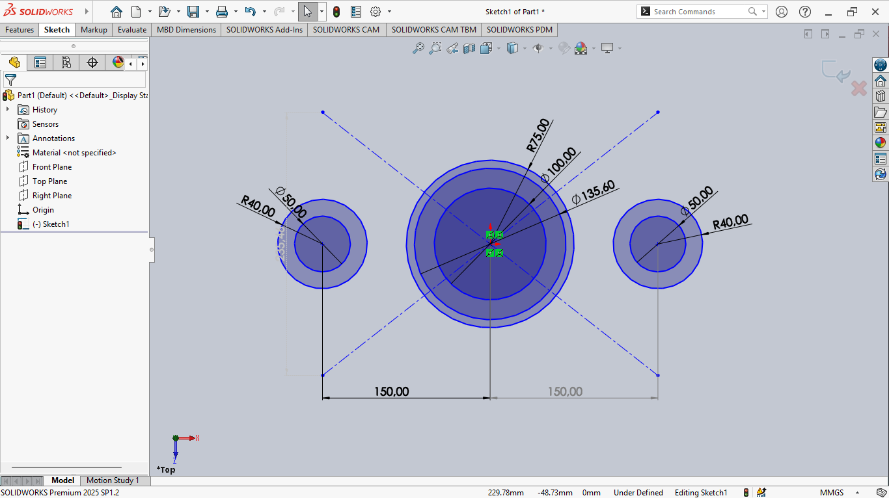
  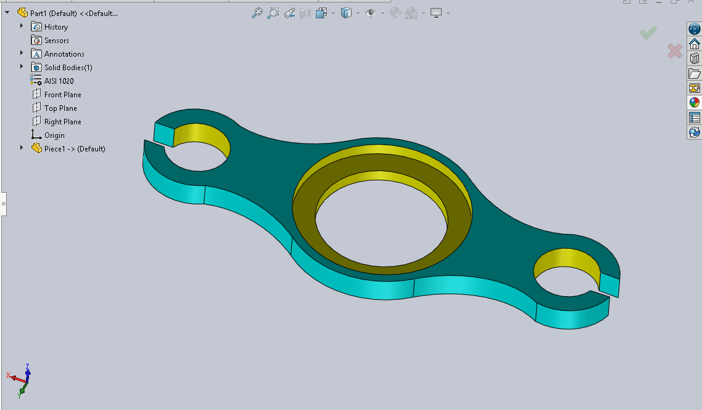

---

### 🔹 2 – Aluminum Alloy 1060
- Calculated Mass: **290.53 g**
- SolidWorks Screenshot:
  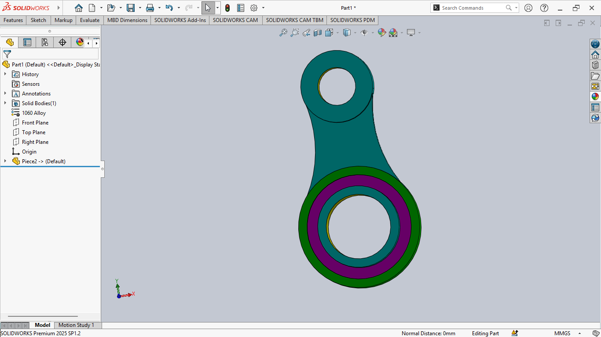
  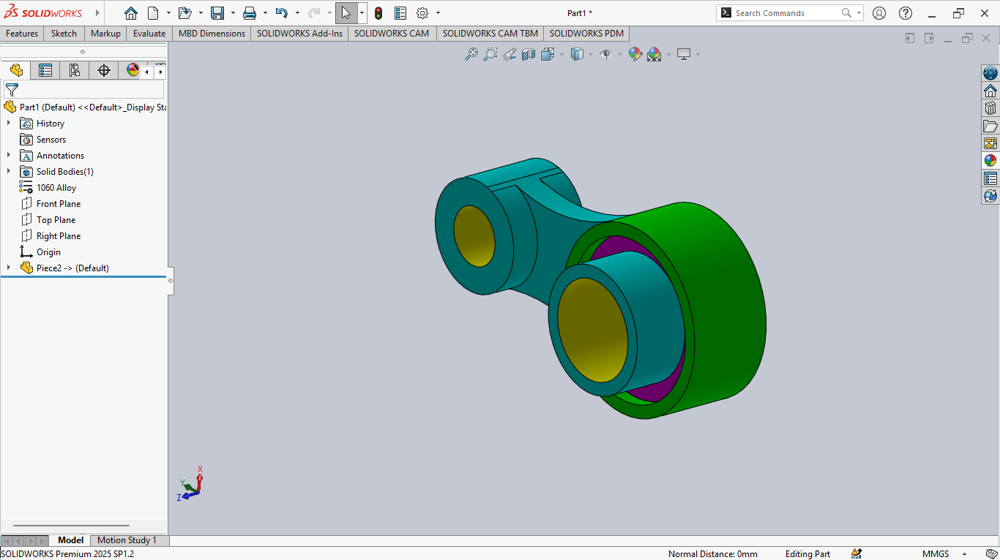

---

### 🔹 3 – AISI 1020 Steel
- Calculated Mass: **1639.86 g**
- SolidWorks Screenshots:
  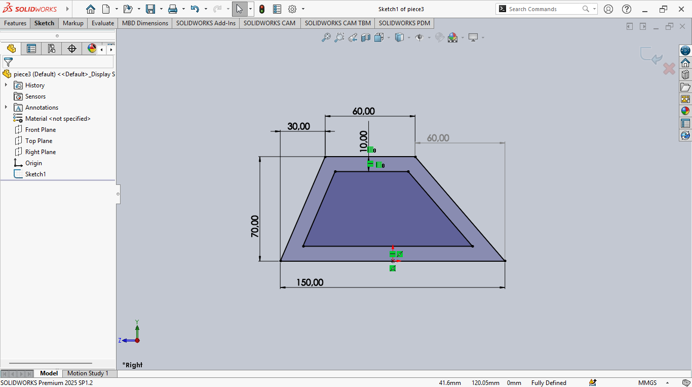
  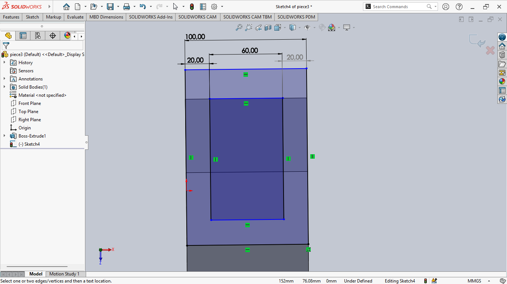
  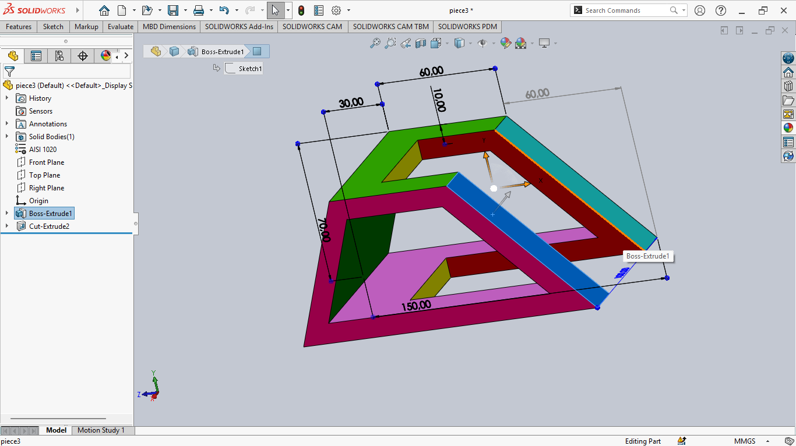
  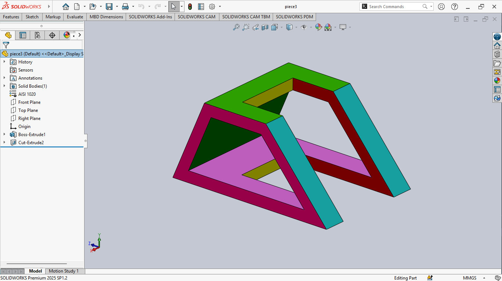

---

<!-- ### 🔹 4 – Aluminum Alloy 1060
- Calculated Mass: **[XX.XX g]**
- Expected Mass: **[XX.XX ± 5%]**
- SolidWorks Screenshot:
  

--- -->

## 🧩 Part 2 – Mechanical Gripper Assembly

### 🧱 Steps Completed:
1. Inserted missing components.
2. Continued the assembly process.
3. Verified the movement of the cylinder and gripper arms.

### ⚙️ Specific Constraints Applied:
- **Cylinder fixed** in minimum and maximum positions to measure the center of gravity.
- **Symmetry between linkages**: enforced using a midplane and symmetry constraint.

### 🔄 Assembly:

 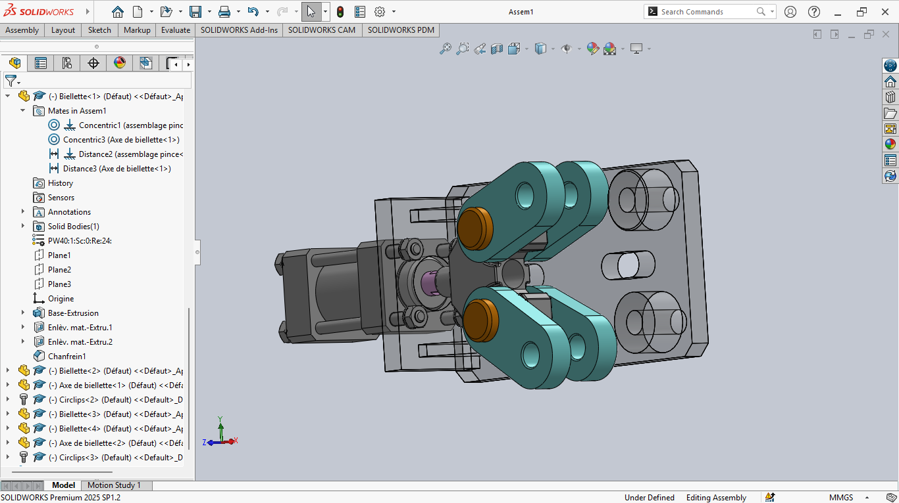

### 🔄 Result:
- minimum position.
 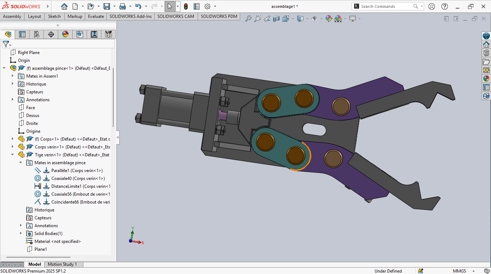

- maximum position.
 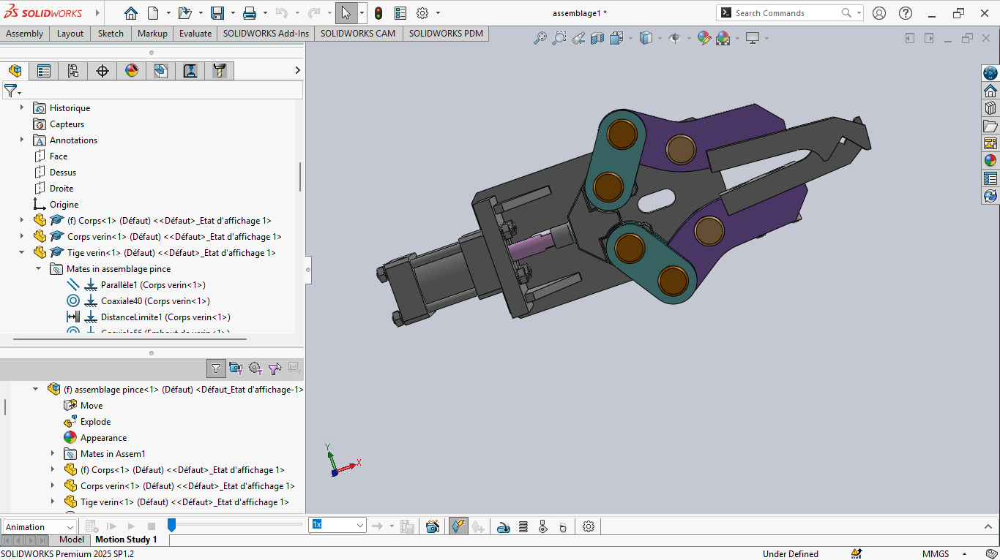
---

## 📍 Mass Analysis Results
### ▶️ Cylinder in **minimum position**:
- Center of mass:
  - **X**: 701.67mm
  - **Y**: 903.47 mm
  - **Z**: 1322.70 mm
### ▶️ Cylinder in **maximum position**:
- Center of mass:
  - **X**: 705.02 mm
  - **Y**: 903.37 mm
  - **Z**: 1322.70 mm
   
---

## 📝 Personal Notes
- The SolidWorks installation caused a slight delay.
- The test helped strengthen our mastery of SolidWorks basics (extrusion, assembly, constraints).
- The concept of **mechanical symmetry** required the use of a **central reference plane**.
- Special attention was given to material selection to ensure realistic mass calculations.

---

## 📂 Files Attached to the GitHub Repository
- `.SLDPRT` files for parts 1 to 3
- `.SLDASM` file for the gripper assembly
- Screenshots of the modeling steps
- PDF exports of mass properties

---
*Document rédigé par Mumu.*