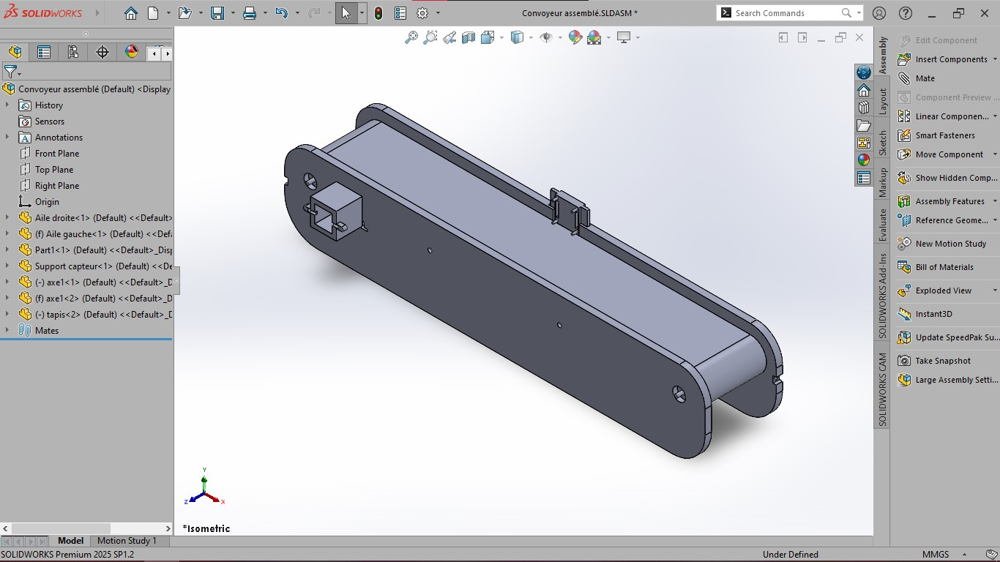

# 📘 Système de Convoyeur de Tri Intelligent

## 1. 🔍 Études Préliminaires

### 1.1 Analyse des besoins fonctionnels

* Transporter des déchets représentés par des cubes de 30 mm.
* Permettre l’arrêt et le redémarrage automatique du tapis selon détection.
* Identifier la couleur du déchet grâce à un capteur pour déterminer le type de tri.
* Diriger manuellement les déchets vers les bacs selon l’indication du système de tri.
* Fournir une structure stable et accessible pour l’intervention humaine.
* Optimiser la sécurité, la légèreté et la fiabilité de l’installation.

### 1.2 Contraintes mécaniques

| Élément            | Spécification                    |
| ------------------ | -------------------------------- |
| Longueur convoyeur | 650 mm                           |
| Hauteur tapis par rapport au sol     | 100 mm                           |
| Poids du déchet    | Environ 20–30 g                  |
| Taille déchet      | Cube de 30 mm x 30 mm x 30 mm    |
| Mode de collecte   | Manuel, après tri                |

### 2.1 Structure

* **Châssis en bois découpé au laser** : Le châssis constitue la structure principale qui soutient et relie tous les composants du convoyeur. Il a été réalisé en bois, découpé au laser, pour garantir une robustesse optimale, une grande stabilité et une précision d’usinage, tout en facilitant l’adaptation aux dimensions requises.

### 2.2 Tapis roulant

* **Bâche PVC** : offre une bonne adhérence, une résistance à l’usure et facilite le nettoyage. Ce matériau est économique et facilement disponible, idéal pour la fabrication d’un tapis roulant adapté au tri des déchets.

### 2.3 Pièces imprimées (plastique PLA/ABS)

* Toutes les pièces ont été imprimées en **plastique (PLA ou ABS)** car l’imprimante disponible ne permettait pas d’utiliser d’autres matériaux.
* Ce choix a aussi l’avantage de produire des pièces **très légères**, facilement adaptables et rapides à fabriquer.

### 2.4 Moteur DC avec réducteur

* Fournit un couple suffisant pour faire avancer le tapis avec une faible consommation.

### 2.5 Capteurs

* **Laser KY-008 + photorésistance** pour la détection de présence.
* **Capteur de couleur TCS3200 ou TCS34725** pour la reconnaissance des types de déchets.

<!-- ### 2.6 Bacs de tri

* Fabriqués en plastique ou métal selon les ressources disponibles.
* Codage couleur : vert, jaune, rouge, bleu. -->

---

## 3. 🧱 Structure Générale du Convoyeur

### 3.1 Description globale

Le convoyeur est composé d’une **structure modulaire** constituée de pièces imprimées en plastique (PLA/ABS) et de parties en bois découpé au laser.  
Il comprend :
* Un tapis roulant en bâche PVC souple achetée
* Un châssis principal en bois découpé au laser pour la stabilité
* Des supports et accessoires imprimés en plastique pour l’intégration des capteurs et du moteur
* Deux rouleaux (poulies) d'entraînement et de retour
* Un support moteur et axe de rotation
* Un châssis rigide en bois découpé au laser avec pieds stabilisateurs
* Un capteur de présence à l’entrée et un capteur de couleur au centre

---

## 4. 🧰 Modélisation CAO – Conception Assistée par Ordinateur

### 4.1 Logiciel utilisé : SolidWorks 2025 Premium S1

La modélisation 3D du convoyeur a été réalisée avec **SolidWorks 2025 Premium S1**, offrant des fonctionnalités avancées pour la conception mécanique, l’assemblage virtuel et la simulation. Ce logiciel permet une visualisation précise des composants, l’analyse des contraintes et l’optimisation du design avant la fabrication.

### 4.2 Présentation des modèles 3D

* **Châssis en bois découpé au laser** : structure principale assurant robustesse et stabilité.
* **Tapis roulant en bâche PVC** : surface mobile montée sur deux rouleaux d’entraînement et de retour.
* **Poulies et rouleaux imprimés en PLA/ABS** : entraînement du tapis via moteur DC avec réducteur.
* **Supports et accessoires pour capteurs** : pièces imprimées en plastique, intégrées au châssis pour optimiser la détection.

### 4.3 Assemblage

* Assemblage final avec insertion des composants électroniques (moteur, capteurs).
* Vérification des dimensions : 650 mm de long, 100 mm de haut.
* Simulation possible du mouvement dans SolidWorks.
* Visualisation en vue éclatée et animation de fonctionnement.

---

## 5. 🧩 Liste des Composants Mécaniques

| Élément                  | Matériau recommandé   | Remarques                                      |
|-------------------------|----------------------|------------------------------------------------|
| Châssis                 | Bois découpé au laser| Structure principale, robuste et stable         |
| Tapis roulant           | Bâche PVC            | Bonne adhérence, largeur ~80 mm                 |
| Poulies d’entraînement  | PLA/ABS (impression 3D) | Diamètre 50 mm, légères et adaptables       |
| Arbre moteur            | PLA/ABS              | Fixation par vis sans tête, compatible moteur   |
| Support moteur          | PLA/ABS (impression 3D) | Fixe le moteur au châssis, léger             |
| Moteur DC avec réducteur| -                    | Fournit le couple, fixé côté gauche             |
| Supports capteurs       | PLA/ABS (impression 3D) | Optimisés pour l’intégration des capteurs    |
| Pieds stabilisateurs    | Bois ou PLA/ABS      | Hauteur totale = 100 mm, stabilité renforcée    |

---

## 6. 🛠️ Assemblage des Composants

### 6.1 Étapes d’assemblage

1. **Montage du châssis** :

   * Couper les profilés plastic à la longueur : 2x 650 mm (longueur) + 2x 100 mm (hauteur).
   * Connecter les montants avec des équerres en aluminium.

2. **Installation du tapis roulant** :

   * Fixer les poulies à chaque extrémité.
   * Monter le tapis sur les poulies avec tension manuelle.
   * Ajouter un tendeur si besoin (ressort ou vis réglable).

3. **Fixation du moteur** :

   * Installer le moteur à l’arrière gauche du châssis.
   * Coupler le moteur à l’arbre de la poulie d’entraînement (avec accouplement ou courroie crantée).

4. **Intégration des capteurs** :

   * Capteur laser ou photorésistance à l’entrée.
   * Capteur de couleur au-dessus du tapis, en position fixe, avec éclairage LED pour régularité.

5. **Installation des bacs** :

   * Positionner les bacs sous la sortie du tapis.
   * Laisser un espace de 5 cm entre chaque bac pour éviter le croisement des déchets.

---

## 7. 📏 Cotation & Tolérances

| Élément               | Dimension       | Tolérance |
| --------------------- | --------------- | --------- |
| Longueur tapis        | 650 mm          | ± 2 mm    |
| Largeur tapis         | 80–100 mm       | ± 1 mm    |
| Hauteur châssis       | 100 mm          | ± 2 mm    |
| Écartement entre bacs | 50 mm           | ± 5 mm    |
| Taille cube de déchet | 30 x 30 x 30 mm | ± 0.5 mm  |

---

## 8. 🧪 Simulation et Vérification

* Test de rotation du tapis sous contrainte de 100 g.
* Vérification de l’alignement du tapis via guides latéraux.
* Simulation de passage d’un déchet sous capteur.
* Vérification des distances pour la chute dans le bac correct.

---

## 9. ✅ Sécurité et Fiabilité

* Arêtes vives ébavurées ou arrondies.
* Structure stable et non basculante.
* Aucun élément saillant dangereux pour les utilisateurs.
* Facilité de démontage pour maintenance.

---

## 10. 📷 Illustration finale du design

