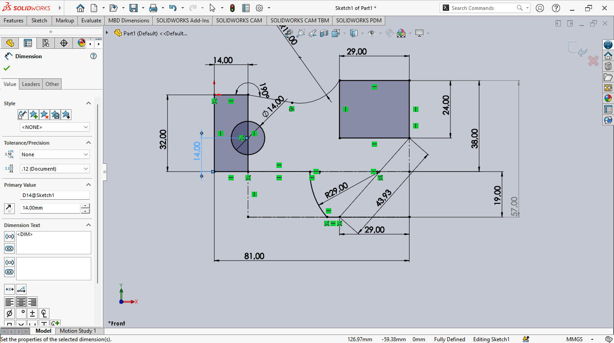

# 📄 Second Mechanical Test |TRC 2025

## 👤 Team
- **Team Name**: [Innovator]
- **Participants**: [Muriella, Nekena,Vanilla,Bobby]
- **Domain**: Mechanical
- **Week**: 1 (June 12, 2025 – June 19, 2025)

## 🎯 Test Objective
Specific Operational Objectives are:

- Develop a part with **precisely calculated dimensions** to achieve the target mass from the first phase.
- Be able **to adjust and optimize the design** during the two successive modification phases while maintaining precision.
- Maintain the final mass of each part within **the ± 1% interval of the reference value** , which requires high precision in calculations and execution.
- Effectively plan **the three phases** so that each modification improves or maintains compliance with specifications.
- **Demonstrate mastery of design and modification tools** to meet strict metric constraints.

## 🛠️ Part 1 
### ✅ Common Parameters:
**Unit system**: MMGS (millimeter, gram, second);
**Decimals**: 2 All holes are through holes unless otherwise indicated Material: AISI 1020 steel; **Density**: 0.0079 g/mm³

## Mechanical clamp assembly
- Calculated Mass: **g**
- SolidWorks Screenshot:
 
 
 
 

