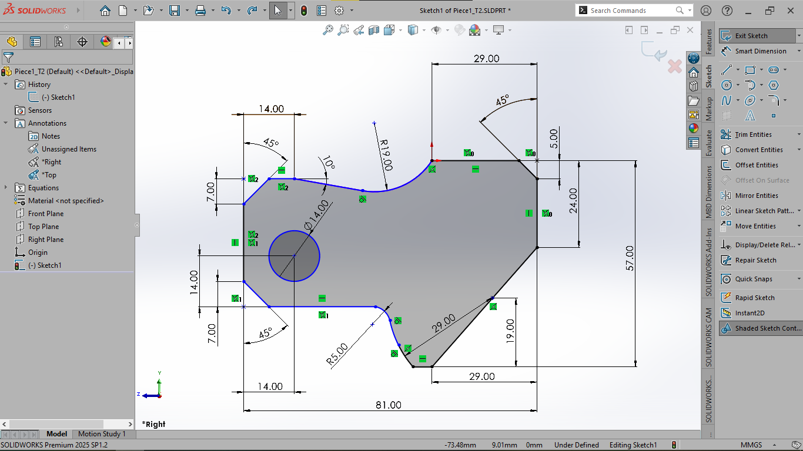
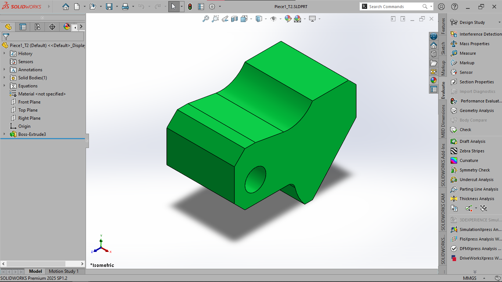
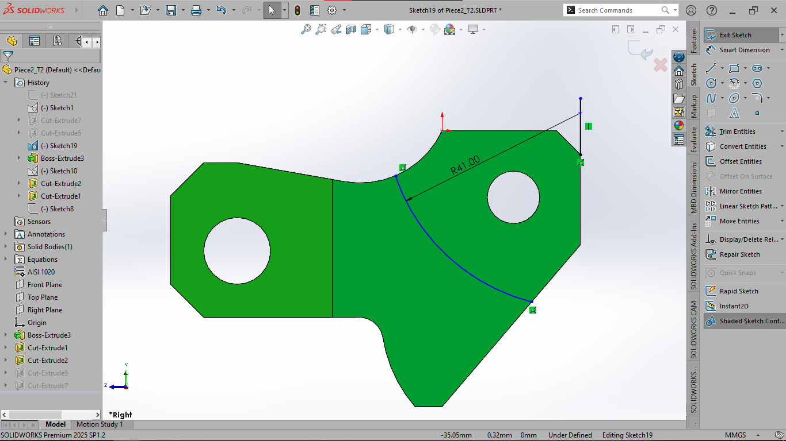
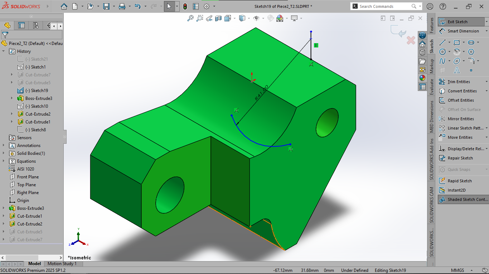
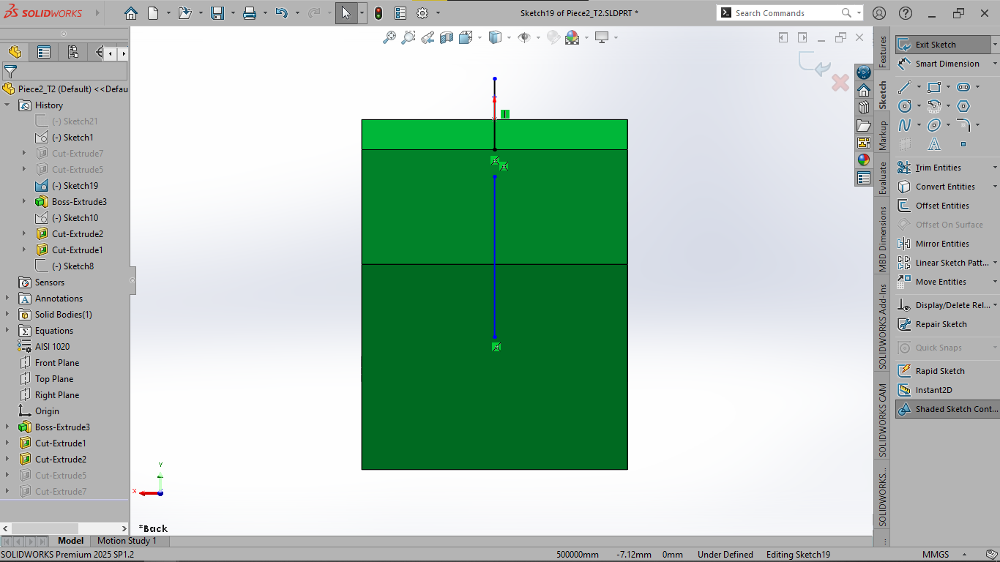
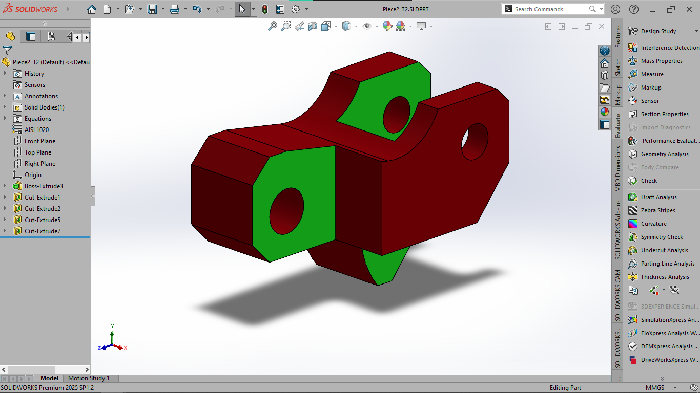
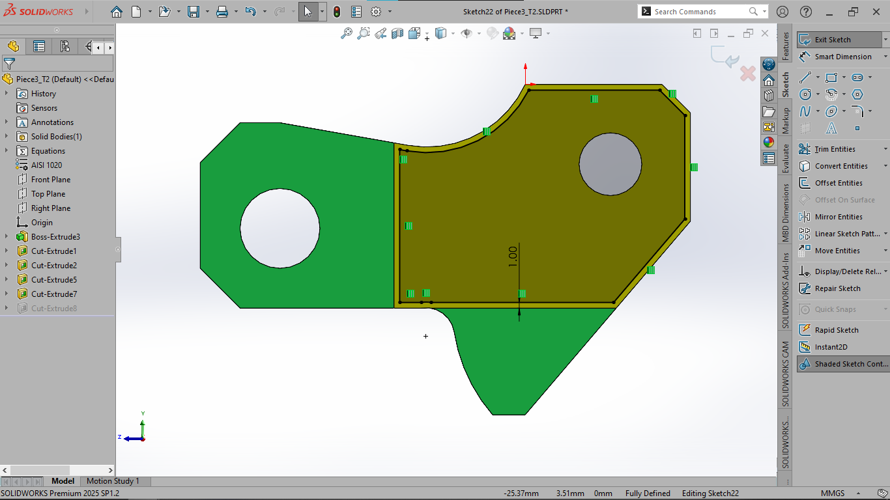
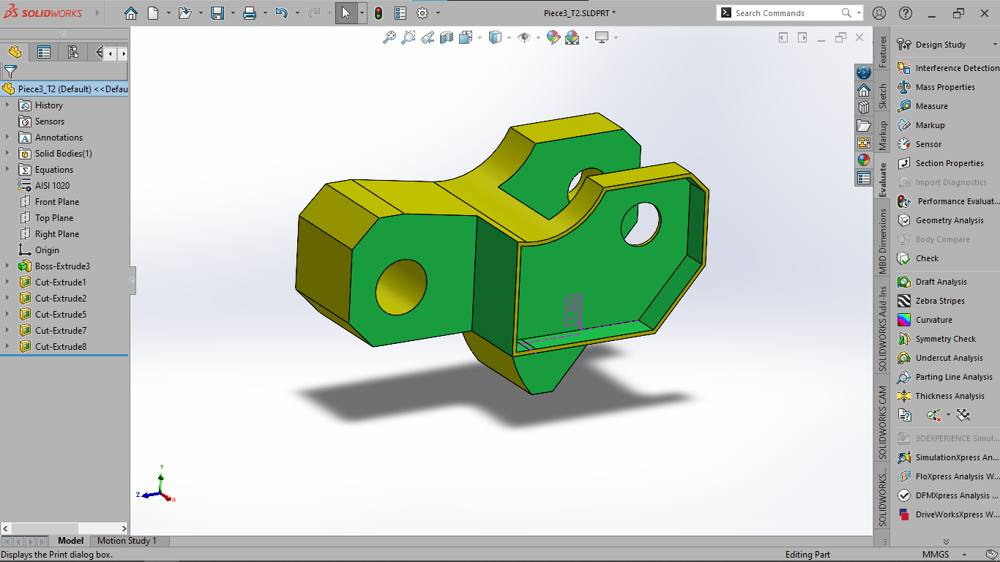

# 📄 Intermediate Mechanical Test | TRC 2025

## 👤 Team
- **Team Name**: [Innovator]
- **Participants**: [Muriella, Nekena, Vanilah]
- **Domain**: Mechanical
- **Week**: 2 (June 13, 2025 – June 19, 2025)

---

## 🎯 Test Objective
This assessment focuses on modeling and assembling intermediate-level mechanical components. The main goals are:
- Create accurate 3D models based on provided technical drawings.
- Compute the **mass** of each part, ensuring a tolerance within ±1%.
- Complete the **assembly of a mechanical sub-system**.
- Determine the **center of mass coordinates** for the assembly in two different configurations.

---

## 🛠️ Part 1 – Component Modeling

### ✅ General Parameters
- **Unit system**: MMGS (millimeter, gram, second)
- **Decimal precision**: 2
- **Materials**:
  - AISI 1020 Steel: density 0.0079 g/mm³

---

### 🔹 1.a – AISI 1020 Steel
- Calculated Mass: **986.37g**
- SolidWorks Screenshots:
  
  

---

### 🔹 1.b – AISI 1020 Steel
- Calculated Mass: **1089.37g**
- SolidWorks Screenshots:
  
  

---

### 🔹 2 – AISI 1020 Steel
- Calculated Mass: **635.23g**
- SolidWorks Screenshots:
  
  
  
  
  

---

### 🔹 3 – Aluminum Alloy 1060
- Calculated Mass: **553.63g**
- SolidWorks Screenshots:
  
  

---

## 📝 Team Notes
- This intermediate test required more advanced assembly techniques and constraint management.
- We gained further experience with reference geometry and advanced mates in SolidWorks.
- Accurate material selection and mass calculation remained essential for reliable modeling.

---

## 📂 Files Included in the GitHub Repository
- `.SLDPRT` files for each component
- Step-by-step modeling screenshots
- PDF exports of mass properties

---
*Documented by Nekena